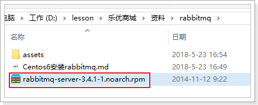
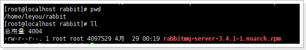
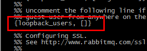
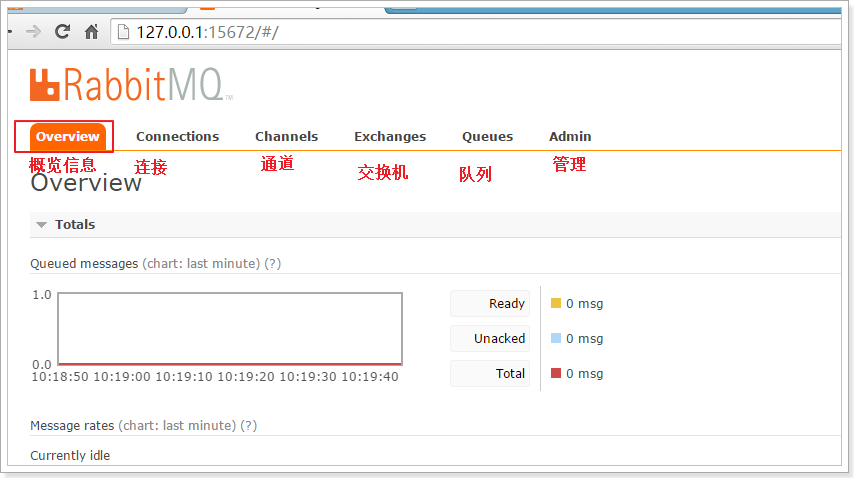
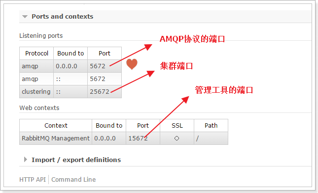
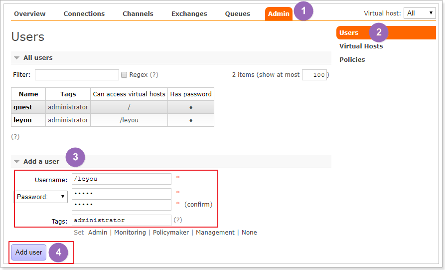
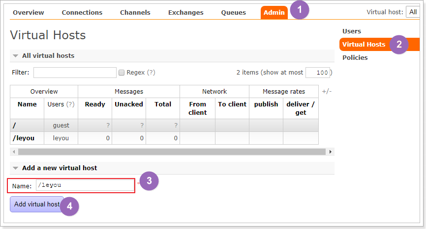
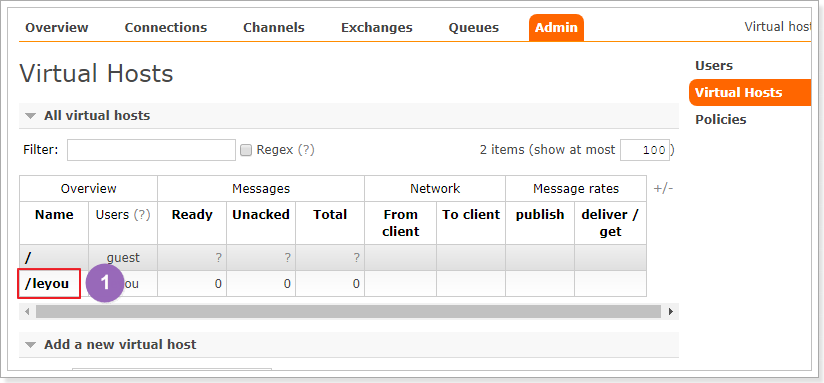
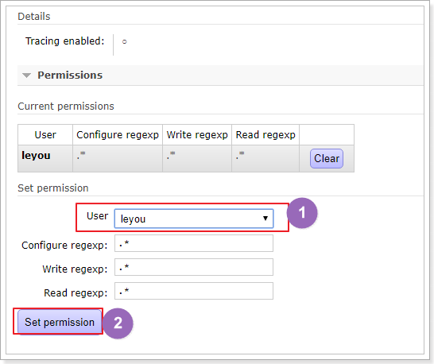

# 0.安装文件准备

首先将课前资料提供的安装包上传到 `/home/leyou/rabbit`目录：

 

这个是RabbitMQ的安装包：

  


# 1.安装Erlang

我们并没有提供Erlang安装包，直接采用yum仓库安装：

```
yum install esl-erlang_17.3-1~centos~6_amd64.rpm
yum install esl-erlang-compat-R14B-1.el6.noarch.rpm
```


# 2.安装RabbitMQ

## 2.1.安装

进入文件所在目录:

```sh
cd /home/leyou/rabbit
```

然后输入命令：

```sh
 rpm -ivh rabbitmq-server-3.4.1-1.noarch.rpm
```


## 2.2.修改配置文件

将配置文件模板复制到etc目录：

```sh
cp /usr/share/doc/rabbitmq-server-3.4.1/rabbitmq.config.example /etc/rabbitmq/rabbitmq.config
```

通过vim命令编辑：

```sh
vim /etc/rabbitmq/rabbitmq.config
```

修改下面内容：

 

**注意要去掉后面的逗号**


## 2.3.设置开机启动

输入下面命令

```sh
chkconfig rabbitmq-server on
```

## 2.4.启动命令

通过下面命令来控制RabbitMQ：

```sh
service rabbitmq-server start
service rabbitmq-server stop
service rabbitmq-server restart
```


## 2.5.开启web管理界面

RabbitMQ提供了用来管理的控制界面，十分方便，不过默认是关闭的。

我们通过命令开启web管理插件：

```sh
rabbitmq-plugins enable rabbitmq_management
```

然后重启RabbitMQ：

```sh
service rabbitmq-server restart
```


## 2.6.开放端口

RabbitMQ默认使用15672端口进行web访问，我们开启防火墙端口：

```sh
/sbin/iptables -I INPUT -p tcp --dport 15672 -j ACCEPT
/etc/rc.d/init.d/iptables save
```


然后在主机中通过地址：http://192.168.56.101:15672即可访问到管理界面


# 3.管理界面介绍

第一次访问需要登录，默认的账号密码为：`guest/guest`

## 3.1.主页



- connections：无论生产者还是消费者，都需要与RabbitMQ建立连接后才可以完成消息的生产和消费，在这里可以查看连接情况
- channels：通道，建立连接后，会形成通道，消息的投递获取依赖通道。
- Exchanges：交换机，用来实现消息的路由
- Queues：队列，即消息队列，消息存放在队列中，等待消费，消费后被移除队列。

端口：

​     

## 3.2.添加用户



上面的Tags选项，其实是指定用户的角色，可选的有以下几个：

- 超级管理员(administrator)

  可登陆管理控制台，可查看所有的信息，并且可以对用户，策略(policy)进行操作。

- 监控者(monitoring)

  可登陆管理控制台，同时可以查看rabbitmq节点的相关信息(进程数，内存使用情况，磁盘使用情况等)

- 策略制定者(policymaker)

  可登陆管理控制台, 同时可以对policy进行管理。但无法查看节点的相关信息(上图红框标识的部分)。

- 普通管理者(management)

  仅可登陆管理控制台，无法看到节点信息，也无法对策略进行管理。

- 其他

  无法登陆管理控制台，通常就是普通的生产者和消费者。

## 3.3.创建虚拟主机（Virtual Hosts）

为了让各个用户可以互不干扰的工作，RabbitMQ添加了虚拟主机（Virtual Hosts）的概念。其实就是一个独立的访问路径，不同用户使用不同路径，各自有自己的队列、交换机，互相不会影响。




创建好虚拟主机，我们还要给用户添加访问权限：

点击添加好的虚拟主机：



进入虚拟主机设置界面：

 

